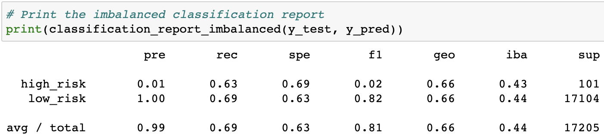

# Credit_Risk_Analysis

## Overview

Credit risk is an inherently unbalanced classification problem, as good loans easily outnumber risky loans. Therefore, we’ll need to employ different techniques to train and evaluate models with unbalanced classes. We'll use imbalanced-learn and scikit-learn libraries to build and evaluate models using resampling.

Using the credit card credit dataset from LendingClub, a peer-to-peer lending services company, we’ll oversample the data using the RandomOverSampler and SMOTE algorithms, and undersample the data using the ClusterCentroids algorithm. Then, we’ll use a combinatorial approach of over- and undersampling using the SMOTEENN algorithm. Next, we’ll compare two new machine learning models that reduce bias, BalancedRandomForestClassifier and EasyEnsembleClassifier, to predict credit risk. Once we’re done, you’ll evaluate the performance of these models and make a written recommendation on whether they should be used to predict credit risk.

## Results

- Naive Random Oversampling results:

- SMOTE Oversampling results:

- Undersampling results:

- Combination(Over and Under) results:

- Balanced Random Forest Classifier results:

- Easy Ensemble AdaBoost Classifier results:

## Summary

For the first four models, we have demonstrated undersampling, oversampling, and even a combination of both in order to determine the most efficient model at predicting high risk loans. For the final two models, we have resampled the data using ensemble classifiers in order to predict both high and low risk loans. The Easy Ensemble modle easily provided the most accurate results, with an accuracy of 91.7%, precision of 99%, and a recall of 94%. With the high accuracy score, and similar precision and recall scores, we can handidly recommend the Easy Ensemble model.
